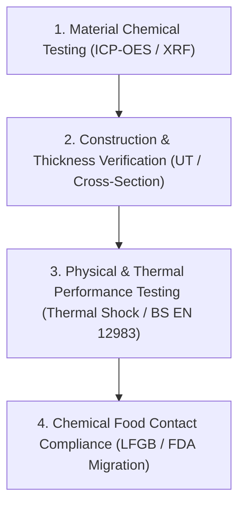

# How to Verify Tri-ply Specifications

## Short Definition

Specification verification is the comprehensive quality assurance protocol that translates a supplier's marketing claims into measurable technical parameters. A rigorous verification sequence connects the commercial quotation, engineering drawings, approved golden samples, raw material mill test reports, accredited laboratory compliance records, and pre-shipment inspections into a unified, version-controlled product specification.

## The Buyer's Verification Protocol

To mitigate product quality risks and prevent supplier specification drift, B2B buyers should establish a four-step verification sequence:

### 1. Material Chemical Analysis (ICP-OES / XRF)
Do not rely solely on mill test certificates provided by the supplier. Independent laboratory testing should verify the elemental composition of the stainless steel skins:
- **Test Method:** Inductively Coupled Plasma Optical Emission Spectrometry (ICP-OES) or handheld X-ray Fluorescence (XRF) analyzers.
- **Verification Criteria:** Confirm that the interior layer meets grade 304 (ASTM A240) chemical requirements, specifically checking that the nickel (Ni) content is between 8.0% and 10.5% and manganese (Mn) is below 2.0%. This prevents the fraudulent substitution of grade 304 with cheaper, low-nickel 200-series stainless steels, which are highly susceptible to corrosion.

### 2. Construction and Thickness Verification
- **Routine Non-Destructive Testing (NDT):** During pre-shipment inspections, inspectors use Ultrasonic Thickness Gauges (UT) with dual-element transducers. The speed of sound is calibrated separately for SUS304, Aluminum, and SUS430 to verify that the layer thicknesses match the specification across multiple points (base, walls, radius).
- **Destructive Verification:** During golden sample approval, one pan must be cut, polished, and subjected to Microscopic Cross-Section Analysis. This measures physical layer thicknesses with microscopic accuracy and verifies 100% void-free metallurgical bonding at the interface boundaries.

### 3. Thermal and Mechanical Performance Testing
- **Thermal Shock (Bond Integrity):** Heat the pan dry to \(200^\circ\text{C} \pm 5^\circ\text{C}\), then quench it immediately in water at \(15\text{--}20^\circ\text{C}\). Repeat this cycle 5 times. Verify there is zero delamination, bubbling, or cracking.
- **Flatness and Warping (BS EN 12983-1):** Measure base concavity before and after thermal shock. The cold concavity must be 0.5% to 1.0% of the base diameter. Post-heating concavity must remain stable, and post-heating convexity must be \(0.0\text{ mm}\) (flat or slightly concave).
- **Handle Strength:** Conduct the 100 N bending load test and the 15,000-cycle lifting/dropping fatigue test on the handle assembly.

### 4. Chemical Food-Contact Compliance (LFGB / FDA Migration)
- **FDA GRAS (US Market):** Verify that the food-contact substances comply with FDA GRAS regulations, ensuring zero leachable lead.
- **German LFGB (European Gold Standard):** Subject the finished pan to specific migration testing in an acidic food simulant (typically 3% acetic acid) under boil-and-hold conditions (e.g., 2 hours at \(100^\circ\text{C}\)). The leachate is analyzed using ICP-MS to verify that heavy metal release values (Lead Pb, Cadmium Cd, Nickel Ni, Chromium Cr) are below the Specific Migration Limits (SML) defined by Council of Europe Resolution CM/Res(2013)9.
- **Sensory Test:** Perform sensory evaluations to confirm that the cookware does not transfer any odor or taste to food during preparation.

## Why It Matters to B2B Buyers

1. **Brand Reputation:** Defective cookware that rusts, warps, or loses its handle damages brand equity and incurs significant retailer chargebacks.
2. **Regulatory Enforcement:** Customs authorities and consumer protection agencies (especially in Germany, France, and the US) regularly perform random testing. Products failing chemical migration tests are subject to immediate import bans, market recalls, and public alerts.
3. **Objective Dispute Resolution:** Establishing a clear, testable specification sheet in the contract makes pre-shipment inspections objective, preventing disputes over subjective terms like "commercial quality."

## Questions to Verify

1. What specific laboratory testing protocols and standards (e.g., BS EN 12983-1, LFGB) are written into the supply contract?
2. Does the inspection plan define the sampling size (AQL levels) for non-destructive ultrasonic testing and destructive cutting?
3. Which accredited third-party laboratories (e.g., SGS, TÜV, Intertek) are authorized to perform compliance testing?
4. What chemical food-contact certifications (FDA, LFGB) apply to the exact coating or metal alloy batch of this production run?
5. Does the supplier maintain a batch-traceability system linking raw steel coils to the finished, packed cartons?

## Common Misunderstandings

- **"Mill test certificates are sufficient proof of material grade."** Mill certificates are easily forged or mixed up. Independent third-party chemical analysis of the finished pan is the only reliable verification.
- **"Testing a single golden sample guarantees production compliance."** Material quality and bonding consistency can fluctuate between production batches. Key characteristics must be tested during pre-shipment inspections.
- **"Food-grade certification is a permanent, one-off approval."** Food-grade migration reports typically expire or must be re-validated if the supplier changes steel mills, polishing compounds, or washing processes.

## Related Resources

- [Tri-ply Layer Materials](tri-ply-layer-materials.md)
- [Bonding, Warping, and Base Flatness](bonding-warping-and-base-flatness.md)
- [Sources and Reference Policy](sources.md)

## Disclaimer

This verification framework is for sourcing education. It does not replace professional legal, regulatory, or quality-engineering consulting. Buyers must adapt these requirements to their specific market regulations and contract structures.
