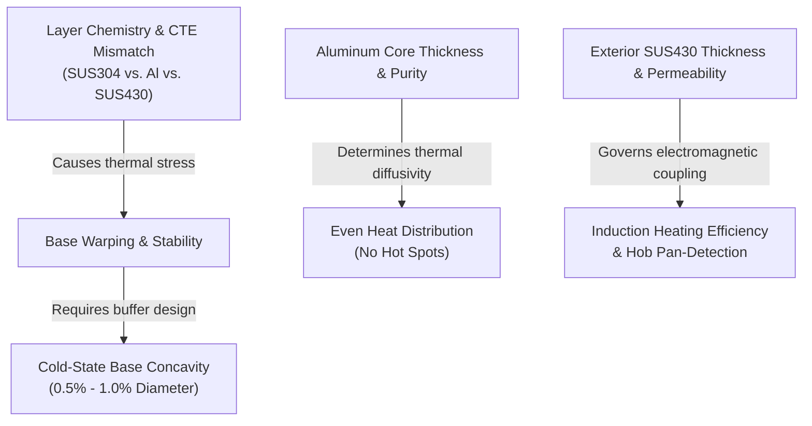

# Tri-ply Cookware Knowledge Base

Practical technical guides for B2B buyers evaluating tri-ply stainless steel cookware materials, construction, performance, and quality control.

---

## B2B Sourcing Quick Reference

If you are currently preparing an RFQ, evaluating supplier quotations, or drafting a quality inspection agreement, you can jump directly to our verification checklist and template:
- **[How to Verify Tri-ply Specifications](how-to-verify-tri-ply-specifications.html)** — A step-by-step verification protocol incorporating material analysis, thickness checks, thermal performance, and food-contact compliance.

---

## The Tri-ply Engineering System Map

To source cookware successfully, buyers should view the vessel thickness, heat distribution, induction compatibility, and warping behaviors not as isolated marketing claims, but as a connected thermodynamic and mechanical system:

---

## Start Here

1. [What Is Tri-ply Cookware?](what-is-tri-ply-cookware.html) — Core definitions, metallurgical bonding, and MMC concepts.
2. [Tri-ply Layer Materials](tri-ply-layer-materials.html) — Austenitic SUS304 chemistry, Alloy 1050/3003 core parameters, ferritic SUS430 properties, and sealed rim solutions.
3. [Full-clad vs. Encapsulated Base](full-clad-vs-encapsulated-base.html) — Draw forming vs. high-pressure impact bonding processes and lateral temperature fields.

## Performance and Construction

- [Cookware Thickness and Weight](cookware-thickness-and-weight.html) — Nominal thickness ratios, dual-element ultrasonic testing, and cross-section validation.
- [Heat Distribution and Hot Spots](heat-distribution-and-hot-spots.html) — Thermal diffusivity formula, IR thermography protocols, and radius zone heat pooling.
- [Induction Compatibility](induction-compatibility.html) — Eddy currents, skin effect, skin depth formula, and pan sensing limits.
- [Bonding, Warping, and Base Flatness](bonding-warping-and-base-flatness.html) — CTE dynamics, BS EN 12983-1 flatness limits, and 5-cycle quenching thermal shock tests.
- [Surfaces, Finishes, Handles, and Lids](surfaces-finishes-handles-and-lids.html) — Ra roughness specs, chemical passivation, and BS EN 12983-1:2023 handle fatigue/torque testing.

## Sourcing and Verification

- [How to Verify Tri-ply Specifications](how-to-verify-tri-ply-specifications.html) — ICP-OES alloy checking, NDT ultrasonic testing, and LFGB heavy metal migration tests.
- [Tri-ply Cookware Glossary](tri-ply-cookware-glossary.html) — Standardized definitions of thermodynamic, mechanical, and compliance terms.
- [Sources and Reference Policy](sources.html) — BS EN 12983-1:2023 references, Germany LFGB, and Council of Europe SRL regulations.

## How to Use This Reference

Use the guides to define measurable engineering requirements before requesting quotations, then verify the agreed construction through drawings, samples, inspections, and applicable laboratory documentation. A general retail label such as “tri-ply,” “18/10,” or “induction-ready” is a starting point, not a complete purchasing specification.

> **Important:** This material is educational and does not replace legal, regulatory, laboratory, engineering, or quality-assurance advice.

[View the source repository on GitHub](https://github.com/goldensea-kitchenware/tri-ply-cookware-knowledge-base)
